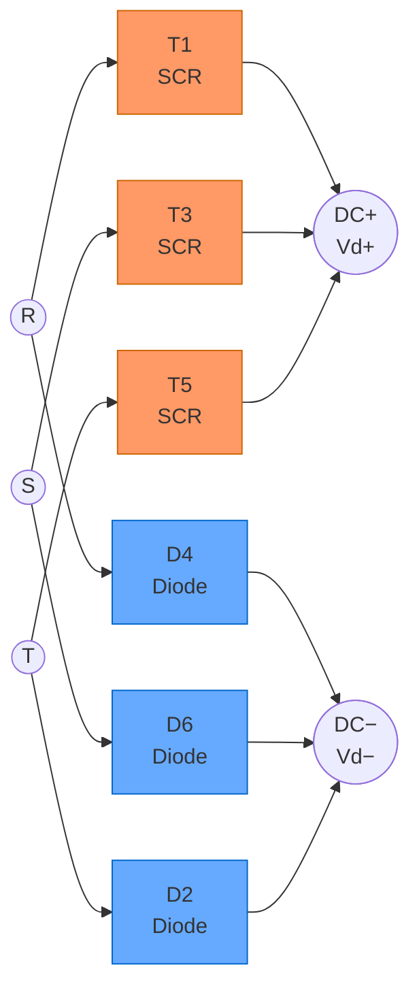

# 3상 반제어 브릿지 정류기 (Three-Phase Half-Controlled Bridge Rectifier)

---

## 1. 개요

3상 반제어 브릿지 정류기(Half-Controlled Bridge Rectifier)는 3상 전파 정류기의 변형으로,  
**상단(High-side) 암에는 사이리스터(SCR)**, **하단(Low-side) 암에는 다이오드**를 사용하는 구조다.

- 완전 제어형(Full-Controlled)에 비해 소자 수가 줄어 비용이 낮다.
- 출력 전압을 0 ~ Vd0 범위로만 제어 가능 (역전압 출력 불가).
- 주로 단방향 전력 제어(전동기 구동, 배터리 충전 등)에 사용된다.

---

## 2. 회로 구조



| Arm | Device | Ref. | Function |
|-----|--------|------|----------|
| High-side | SCR (Thyristor) | T1, T3, T5 | Firing angle α controls conduction instant |
| Low-side  | Diode           | D4, D6, D2 | Natural commutation, uncontrolled           |

> Device numbering follows IEC convention:  
> T1 → R-phase high, T3 → S-phase high, T5 → T-phase high  
> D4 → R-phase low,  D6 → S-phase low,  D2 → T-phase low

---

## 3. 동작 원리

### 3.1 상단 암 (SCR) 동작

각 사이리스터는 해당 상의 전압이 가장 높은 구간에서 게이트 펄스를 인가받아 도통한다.  
자연 점호점(Natural Commutation Point)으로부터 **점호각 α** 만큼 지연되어 점호된다.

- 자연 점호점: 각 상 전압이 교차하는 시점 (선간 전압 기준 30° 오프셋)
- 도통 유지: 다음 SCR이 점호될 때까지 (120° 구간)
- α = 0° → 최대 출력 전압 (다이오드 정류와 동일)
- α 증가 → 출력 전압 감소

### 3.2 하단 암 (다이오드) 동작

하단 다이오드는 가장 낮은 전위의 상에서 자동으로 도통한다.  
별도의 트리거 없이 자연 전류 경로를 제공한다.

### 3.3 전류 경로

출력 전류는 항상 **상단 1개의 SCR + 하단 1개의 다이오드** 를 통해 흐른다.  
예) T1(R상) + D6(S상) → 선간 전압 $V_{RS}$ 가 부하에 인가

### 3.4 게이트 펄스 타이밍 다이어그램

```
  α = firing angle (0° ≤ α ≤ 150°), measured from NCP (Natural Commutation Point)

  ←─────────────────────── one cycle (360°) ────────────────────────→

              NCP_R               NCP_S               NCP_T
                │                   │                   │
  θ:  0°  30°  60°  90° 120° 150° 180° 210° 240° 270° 300° 330° 360°
      │    │    │    │    │    │    │    │    │    │    │    │    │

  VR: /─────────────\                                          /────
       (+, peak 90°) \────────────────────────────────────────/

  VS: ─────────────────/─────────────\
                        (+, peak 210°) \────────────────────────────

  VT: ─────────────────────────────────────/─────────────\
                                            (+, peak 330°) \─────────

           ├── α ──┤           ├── α ──┤           ├── α ──┤
  G_T1: ───────────▐───────────────────────────────────────────────
                (30°+α) ← gate pulse (narrow trigger)

  G_T3: ─────────────────────────────▐───────────────────────────
                                  (150°+α)

  G_T5: ─────────────────────────────────────────────▐───────────
                                                  (270°+α)

  T1  : ─────────[██████████████████████]─────────────────────────
  cond      (30°+α)    ←── 120° ──→    (150°+α)

  T3  : ─────────────────────────────────[██████████████████████]─
  cond                             (150°+α)   ←── 120° ──→  (270°+α)

  T5  : ───────────────────────────────────────────────[██████████
  cond                                           (270°+α) ← 120° →

  Vd  : ─────────/▔▔▔╲/▔▔▔╲/▔▔▔╲/▔▔▔╲/▔▔▔╲/──── (DC output)
        ← ripple frequency = 6 × f_input (e.g. 360 Hz @ 60 Hz) →

  α = 0°  → Vd = Vd0      (maximum, same as uncontrolled diode bridge)
  α = 90° → Vd = Vd0 / 2  (half output)
  α = 150°→ Vd ≈ 0        (minimum)
```

---

## 4. 출력 전압 수식

### 4.1 평균 출력 전압

$$
V_d = \frac{3\sqrt{3}}{2\pi} V_m (1 + \cos\alpha)
$$

또는 선간 전압 실효값 $V_L$ 로 표현하면:

$$
V_d = \frac{3\sqrt{6}}{2\pi} V_L (1 + \cos\alpha) \approx \frac{3V_{LL,pk}}{2\pi}(1 + \cos\alpha)
$$

- $V_m$: 상전압 최대값 ($V_m = \sqrt{2} \cdot V_{phase}$)
- $V_L$: 선간 전압 실효값
- α: 점호각 (0° ~ 180°, 실용 범위 0° ~ 150°)

### 4.2 무부하 최대 출력 전압 (α = 0°)

$$
V_{d0} = \frac{3\sqrt{3}}{\pi} V_m = \frac{3\sqrt{6}}{\pi} V_{phase,rms}
$$

예) 220 V (상전압 실효값) 입력 시:

$$
V_{d0} = \frac{3\sqrt{6}}{\pi} \times 220 \approx 514 \text{ V}
$$

### 4.3 점호각에 따른 출력 전압 비

| α (°) | $V_d / V_{d0}$ |
|--------|----------------|
| 0      | 1.000          |
| 30     | 0.933          |
| 60     | 0.750          |
| 90     | 0.500          |
| 120    | 0.250          |
| 150    | 0.067          |
| 180    | 0.000          |

---

## 5. 전파형 특성

### 5.1 맥동 (Ripple)

- 출력 전압의 맥동 주파수: **입력 주파수의 6배** (60 Hz 입력 → 360 Hz 맥동)
- 단, 반제어형은 α가 커질수록 맥동률이 증가하는 특성이 있음
- α > 60° 이상에서 파형의 불연속 구간이 발생할 수 있음

### 5.2 환류 다이오드(Freewheeling) 효과

반제어 브릿지는 구조적으로 **내부 환류 경로**가 형성된다.  
상단 SCR 중 하나가 도통 중인 상태에서 하단 다이오드가 전환되면,  
상단 SCR + 하단 신규 다이오드 경로를 통해 전류가 환류할 수 있다.

→ 이 내부 환류 효과로 인해 출력 전압이 **음(-)으로 내려가지 않는다.**  
→ 별도 환류 다이오드(FWD) 없이도 유도성 부하에서 안정적으로 동작 가능.

---

## 6. 완전 제어형과의 비교

| 항목 | 반제어 (Half-Controlled) | 완전 제어 (Full-Controlled) |
|------|--------------------------|------------------------------|
| 상단 소자 | SCR × 3 | SCR × 3 |
| 하단 소자 | Diode × 3 | SCR × 3 |
| 출력 전압 범위 | 0 ~ +Vd0 | -Vd0 ~ +Vd0 |
| 역전력 전송 | 불가 | 가능 (인버터 모드) |
| 제어 복잡도 | 낮음 | 높음 |
| 역률 | 완전 제어형보다 양호 | 낮음 (α 클수록) |
| 환류 다이오드 | 내부 경로로 불필요 | 별도 FWD 필요한 경우 있음 |
| 적용 | 단방향 구동, 충전기 | 4상한 구동, 회생 제동 |

---

## 7. 게이트 트리거 타이밍

각 SCR의 자연 점호점 기준 위상각:

| SCR | 상 | 자연 점호점 (위상) | 점호 시점 (점호각 α 적용) |
|-----|----|--------------------|--------------------------|
| T1  | R  | 30°                | 30° + α                  |
| T3  | S  | 150°               | 150° + α                 |
| T5  | T  | 270°               | 270° + α                 |

- 게이트 펄스 간격: 120°
- 펄스 폭: 최소 10~20 μs (또는 연속 펄스 트레인 권장)

### 7.2 Active-LOW 게이트 제어 (옵토커플러 반전 회로)

임베디드 시스템에서 GPIO로 SCR 게이트를 직접 구동하지 않고,  
**옵토커플러(optocoupler) 또는 게이트 드라이브 IC를 통해 절연**하는 경우,  
회로 구성에 따라 신호 극성이 반전(invert)될 수 있다.

#### 반전 회로 예시

```
  MCU GPIO ──→ Optocoupler ──→ Gate Drive ──→ SCR Gate
                (inverting)
  GPIO HIGH  →  LED OFF  →  Gate current = 0  →  SCR OFF
  GPIO LOW   →  LED ON   →  Gate current > 0  →  SCR ON
```

#### 펌웨어에서의 논리 대응

| GPIO 상태 | 물리 신호 | SCR 상태 |
|-----------|-----------|----------|
| `SET` (HIGH, 1) | Gate pulse 없음 | **OFF** (비도통) |
| `CLEAR` (LOW, 0) | Gate pulse 인가 | **ON** (도통 시작) |

> **주의**: Active-LOW 방식에서는 MCU 초기화(reset) 시 GPIO 기본값이 HIGH이면  
> SCR은 안전하게 OFF 상태를 유지한다. 반대로 기본값이 LOW인 경우  
> 부팅 순간 의도치 않게 SCR이 도통될 수 있으므로 **GPIO 초기 상태 설계에 주의**가 필요하다.

#### 코드 작성 시 관례

혼동을 방지하기 위해 추상화 매크로를 정의하는 것을 권장한다:

```c
/* Active-LOW gate drive: physical LOW = SCR ON */
#define SCR_GATE_ON(port, pin)   GPIO_ResetBits(port, pin)  /* CLEAR */
#define SCR_GATE_OFF(port, pin)  GPIO_SetBits(port, pin)    /* SET   */
```

이렇게 하면 코드 상에서 `SCR_GATE_ON` / `SCR_GATE_OFF` 만 보고  
의도를 파악할 수 있어 유지보수성이 높아진다.

---

## 8. 주요 소자 정격 계산

### 8.1 SCR / 다이오드 전압 정격

소자에 걸리는 최대 역전압(PIV):

$$
V_{PIV} = \sqrt{6} \cdot V_{phase,rms} = \sqrt{2} \cdot V_{L,rms}
$$

예) 220 V 계통 (상전압) → $V_{PIV} = \sqrt{6} \times 220 \approx 539 \text{ V}$

설계 마진 고려 시 **정격 전압의 2배 이상** 선택 권장.

### 8.2 평균 전류 정격

$$
I_{T,avg} = \frac{I_d}{3}
$$

($I_d$: 직류 출력 평균 전류)

### 8.3 실효값 전류 정격

$$
I_{T,rms} = \frac{I_d}{\sqrt{3}}
$$

---

## 9. 적용 시 고려 사항

- **스너버 회로(Snubber)**: SCR의 dv/dt 내량 확보를 위해 RC 스너버 적용
- **게이트 드라이브 절연**: 게이트 회로는 주회로와 절연 (포토커플러, 펄스 트랜스)
- **냉각**: 소자 손실은 $P = V_T \times I_{avg} + r_T \times I_{rms}^2$ 로 산출
- **입력 측 ACL (교류 리액터)**: 전류 왜곡 저감 및 단락 전류 제한 목적으로 삽입 권장
- **EMC**: 고주파 스위칭 노이즈 대책 필요

---

## 트러블슈팅 노트

### MCU 무전원 상태에서 오실로스코프로 게이트 전압이 측정되는 현상

#### 증상
- MCU(임베디드 시스템)에 전원이 없어 옵토커플러가 동작하지 않는 상태임에도,  
  오실로스코프로 SCR 게이트 전압을 측정하면 전압이 잡힘.
- 게이트-GND 간 전압이 음수(−)로 측정됨.

#### 원인 1: 게이트 부유(Floating Gate) + 용량성 결합

옵토커플러 출력 트랜지스터가 OFF이면 게이트는 **고임피던스(floating) 상태**가 된다.  
SCR 내부에는 양극(Anode)과 게이트(Gate) 사이에 **기생 커패시턴스($C_{ag}$)** 가 존재하며,  
수백 V의 AC 양극 전압이 이 경로를 통해 게이트에 **용량성 결합**된다.

```
Anode (high voltage AC)
    │
   [Cag] ← 기생 커패시턴스 $C_{ag}$ (수 pF ~ 수십 pF)
    │
   Gate (floating) ──→ 오실로스코프에 전압 측정됨
```

#### 원인 2: 측정 기준점 오류 → 음(−) 전압 출력

High-side SCR의 캐소드(K)는 **DC+ 버스**에 연결된다.  
오실로스코프 프로브 GND를 시스템 GND(DC−, Earth)에 연결하면:

$$
V_{measured} = V_{gate}(abs) - V_{probe\_GND}(abs)
$$

양극 전압이 높아지는 구간에서 $V_{measured}$가 음수(−)로 읽힌다.  
게이트-캐소드 전압을 올바르게 측정하려면 **프로브 GND를 캐소드(K)에 연결**해야 한다.

#### 대책: 게이트-캐소드 풀다운 저항 (R_GK)

게이트가 floating 되지 않도록 G-K 사이에 저항을 삽입하여 방전 경로를 확보한다.

```
  Gate ──┬──[Optocoupler output / Gate drive]
         │
        [R_GK]  ← 1 kΩ ~ 10 kΩ (일반적)
         │
  Cathode (K)
```

| R_GK 값 | 효과 |
|---------|------|
| 너무 작음 (< 100 Ω) | 게이트 구동 전류가 분류되어 트리거 감도 저하 |
| 적정 (1 kΩ ~ 10 kΩ) | 부유 전하 방전 + 오발호(false triggering) 방지 |
| 너무 큼 (> 100 kΩ) | 방전이 느려 dv/dt에 의한 오도통 위험 |

- **추가 효과**: 높은 dv/dt(전압 상승률)에 의한 의도치 않은 자연 도통(dv/dt triggering) 억제
- SCR 데이터시트의 $dv/dt$ 내량 및 게이트 감도($I_{GT}$) 사양을 참고하여 R_GK 값 선정

---

## Reference

- Mohan, Undeland, Robbins — *Power Electronics* (3rd Ed.)
- IEC 60146 — Semiconductor Converters
